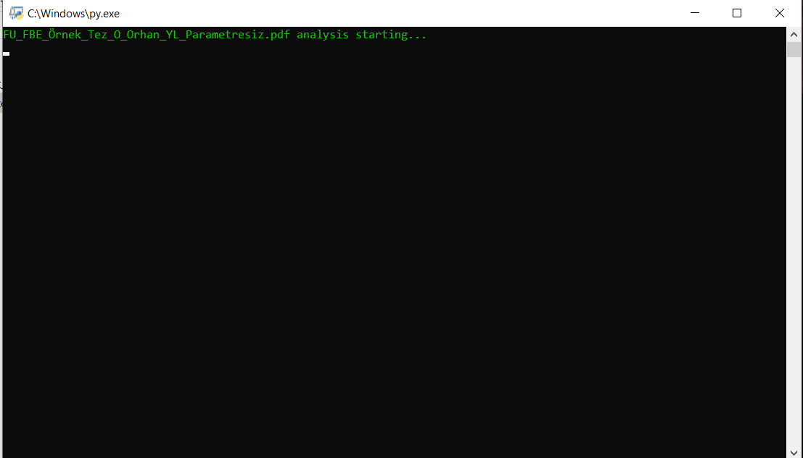

# Tez_Analiz_Sistemi

<h3> .exe dosyasını tez_analiz_sistemi setup klasöründe bulabilirsiniz </h3>

<h3> python 3.6  güncelemesinden dolayı 
.exe dosyasını çalıştırıp sonrs .py dosyasını çalıştırmanız gerekmektedir.</h3> 

### Giriş Yapılması

### Bulunduğu dosya yolundaki dosyaların taranması işlemi

### doc veya pdf uzantılı dosyanın bulunup  taranması

### pdf'in içindeki tabloların  kontrol edilmesi

### pdf'in içindeki başlıkların  kontrol edilmesi

### Çekilen özelliklerin ve bulunan hataların  text dosyasına yazdırılma işlemi

### Youtube

 <a href="https://youtu.be/srrqztw6fbM" target="_blank">  Youtube Video Anlatım : https://youtu.be/srrqztw6fbM  </a>
## Getting Started

    

